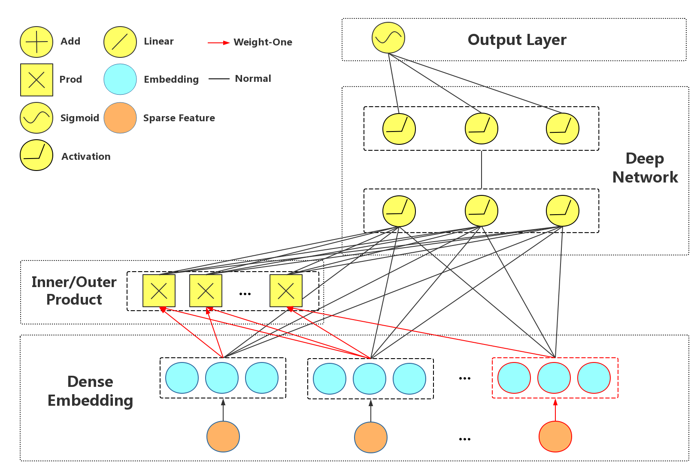
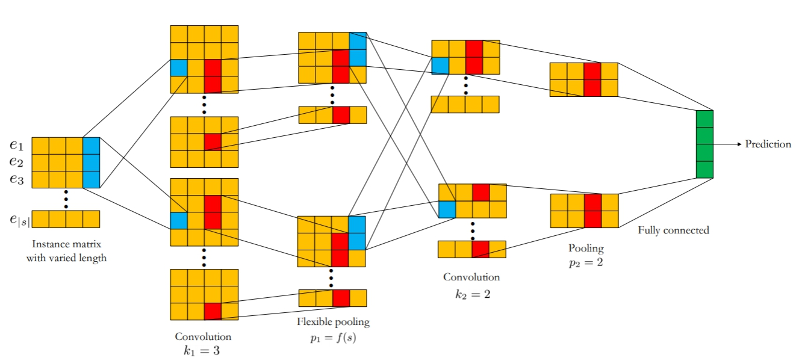
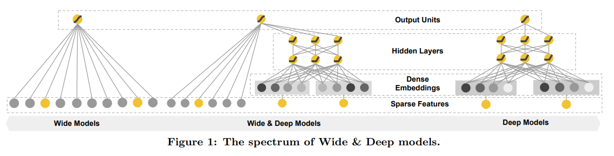
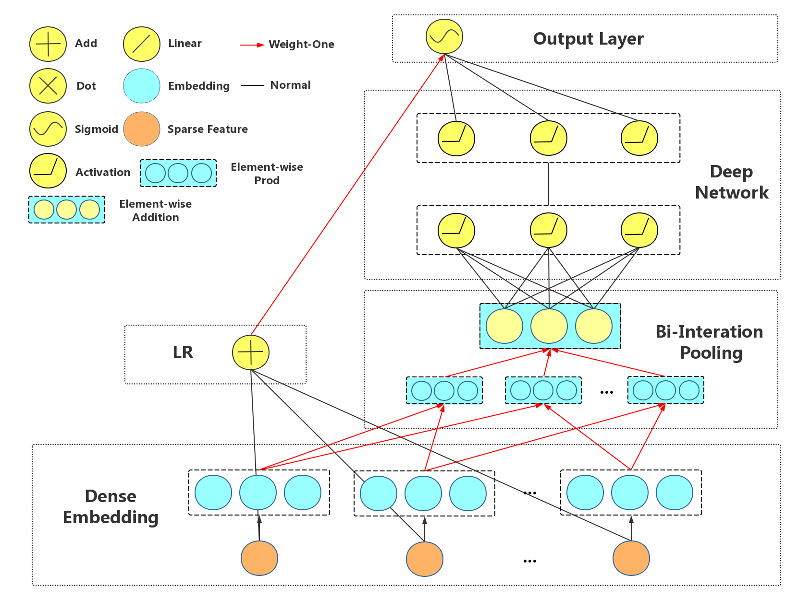
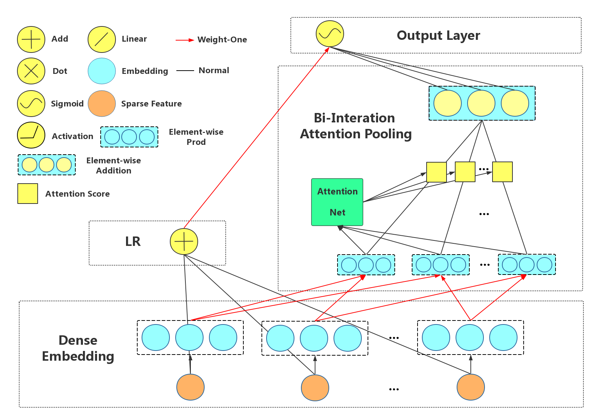
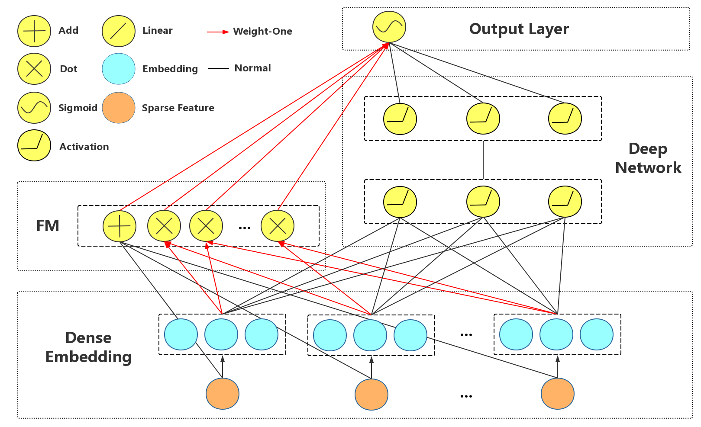
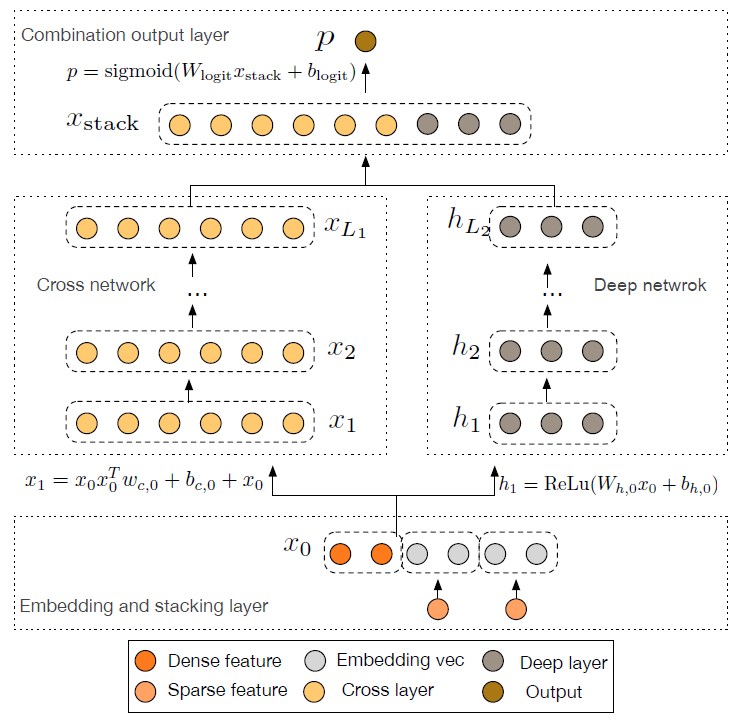
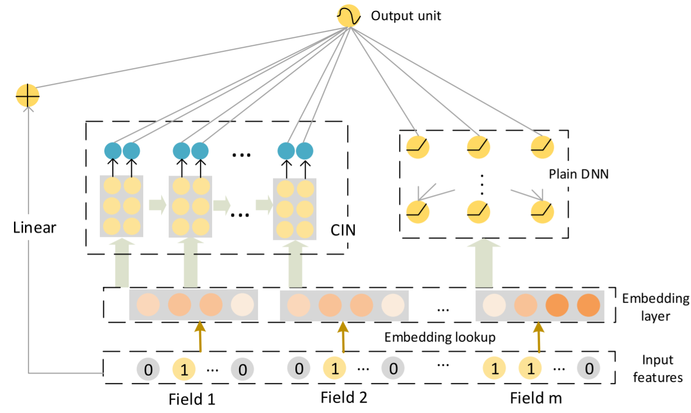

# Click-Through-Rate (CTR) prediction
## Model Design & Comparison for Recommendation Models
<!--https://latex.codecogs.com/eqneditor/editor.php-->
本專案將試著套用多種不同方法在不同資料集上。使用的方法主要分成兩類分別為第一類經典法及第二類以神經網路為主的相關方法。

在第一類的方法以下方方式執行
```r
python3 mf_main.py -dataname
```
```r
python3 fm_main.py -dataname
```

而第二類的方法以下方方式執行
```r
python3 deepctr_main.py -dataname -modelname 
```

### Dataset Intro
資料集共三種分別為: `movielens`, `yelp` 及 `douban_book`

- `movielens`:
  - User ID range: [1,943]
  - Item ID range: [1,1682]
  - User features: age, occupation
  - Item features: genre (multivalued)
- `yelp`:
  - User ID range: [1,16239]
  - Item ID range: [1,14284]
  - User features: compliment (multivalued)
  - Item features: city, category (multivalued)
- `douban_book`:
  - User ID range: [1,13024]
  - Item ID range: [1,22347]
  - User features: location, group (multivalued)
  - Item features: year, author, publisher

### Measure criteria
- `RMSE (real valued)`

  <p align="center">
  
  </p>

- `Recall@10 (binary)`:
Recall at 10 is the proportion of relevant items found in the top-10 recommendations.

  - Relevant item: Has a actual rating >= 3.5
  - Irrelevant item: Has a actual rating < 3.5

  <p align="center">
  <br >
  
  </p>

- `NDCG@10 (binary)`:NDCG is a measure of ranking quality.

  <p align="center">
  <br >
  
  <br >
  
  <br >
  
  <br >
  
  </p>

<!---
$$\mathrm{RMSE}=\sqrt{\frac{1}{N}\sum_{i=1}^{N}{(y_{i}-\hat{y}_{i})^2}}$$

$$\mathrm{Recall@10}=\frac{\mathrm{Total \,\, number \,\, of \,\, recommended \,\, items \,\, @10 \,\, that \,\, are \,\, relevant}}{\mathrm{Total \,\, number \,\, of \,\, relevant \,\, items}}$$

$$\mathrm{NDCG@10}=\frac{\mathrm{DCG@10}}{\mathrm{iDCG@10}}$$

$$\mathrm{DCG@10}=\sum_{i=1}^{10}{\frac{I_{\mathrm{item \,\,is \,\, relevant}}(\mathrm{recommended \,\, item} \,\, i)}{log_2(i+1)}}$$

$$\mathrm{iDCG@10}=\sum_{i=1}^{10}{\frac{1}{log_2(i+1)}}$$

$$I_{\{\mathrm{condition}\}}(.):\mathrm{indicator \,\, function}$$
--->

### Methods

#### Typical Methods

- `Matrix Factorization (MF)`:\
矩陣分解的推薦系統的核心概念認為用戶興趣主要被少數的因素所影響以及商品被選擇與否也是受到少數的因素影響。因此將評分矩陣(Rating Matrix)拆解，投射到低維度的矩陣的隱因子空間(Latent Factor Space)。主要運用奇異值分解法(Singular Value Decomposition, SVD)進行矩陣分解，將原本的評分矩陣拆解成使用者因子矩陣(User Factor Matrix)以及物品因子矩陣(Item Factor Matrix)。
- `Factorization Machine (FM)`:\
Factorization Machine在稀疏資料(Sparse Data)進行特徵交叉(Feature Interaction)並抽取出潛在因子(Latent Factor)，可在線性時間複雜度來進行訓練，且方便規模化。相較於簡易線性模型多考量了交互作用項，又比二階多項式迴歸(Degree-2 Polynomial Regression)更加具備泛化(Generalization)的能力。

  <p align="center">
  
  </p >

  since
  <p align="center">
  
  </p >
  then
  <p align="center">
  

  In another way, we can treat $\mathrm{v}_i, \mathrm{v}_j$ as output from multi-filed embedding layers.
  <p align="center">
  


<!--
$$\begin{aligned}
y(\mathrm{x}) 
&= {w_0} + {\sum_{i=1}^{n}{w_i x_i}} + {\sum_{i=1}^{n}{\sum_{j=i+1}^{n}{\left\langle \mathrm{v}_{i}, \mathrm{v}_{j} \right\rangle x_i x_j }}} \\
&= {w_0} + {\sum_{i=1}^{n}{\mathrm{w}_i x_i}} + \frac{1}{2} \left[ \left\langle \sum_{i=1}^{n}{x_i \mathrm{v}_i} , \sum_{i=1}^{n}{x_i \mathrm{v}_i} \right\rangle - \sum_{i=1}^{n}{\left\langle x_i \mathrm{v}_i , x_i \mathrm{v}_i \right\rangle} \right] \\
\end{aligned}
$$

$$\left\langle \sum_{i=1}^{n}{x_i \mathrm{v}_i} , \sum_{i=1}^{n}{x_i \mathrm{v}_i}\right\rangle = \sum_{i=1}^{n}{\left\langle x_i \mathrm{v}_i , x_i \mathrm{v}_i \right\rangle} + 2 \sum_{i=1}^{n}{\sum_{j=i+1}^{n}{\left\langle x_i \mathrm{v}_i , x_j \mathrm{v}_j \right\rangle}}$$

$$\sum_{i=1}^{n}{\sum_{j=i+1}^{n}{\left\langle x_i \mathrm{v}_i \, , \, x_j \mathrm{v}_j \right\rangle}}=\frac{1}{2} \left[ \left\langle \sum_{i=1}^{n}{x_i \mathrm{v}_i} \, ,\,  \sum_{i=1}^{n}{x_i \mathrm{v}_i} \right\rangle - \sum_{i=1}^{n}{\left\langle x_i \mathrm{v}_i \, , \, x_i \mathrm{v}_i \right\rangle} \right]$$

$$\begin{aligned}
y(\mathrm{x}) &= w_0+\sum_{i=1}^{n}{w_ix_i}+\sum_{i=1}^{n}{\sum_{j=i+1}^{n}{\left\langle \mathrm{v}_i, \mathrm{v}_j \right\rangle x_ix_j}} \\ 
&= w_0+\sum_{i=1}^{n}{w_ix_i}+\sum_{k=1}^{K}{\sum_{q=k+1}^{K}{\left\langle \mathrm{W}^{(k)} \mathrm{x}[\mathrm{start}_k:\mathrm{end}_k], \mathrm{W}^{(q)} \mathrm{x}[\mathrm{start}_q:\mathrm{end}_q] \right\rangle}} \\
\end{aligned}
$$

-->

#### NN-based Methods
- `FM-supported Neural Network (FNN)`:\
以 Factorization Machine(FM) 為基礎，將 FM 所產生的特徵向量，投入一個類神經網路中，以 Multi-Layer Perceptron(MLP) 代替內積來進行預測任務。

  <p align="center">
  
  <br >
  
  </p>

- `Product-based Neural Networks (IPNN, OPNN)`:\
比起 FNN ，在 MLP 的輸入加入每個 field 之間 inner/outer product 的特徵交叉。
  <p align="center">
  
  <br >
  
  <br >
  
  <br >
  
  <br >
  
  </p>

<!--
$$y(\mathrm{x})=\mathrm{MLP}(\mathrm{cancat}([\mathrm{v}_1,\mathrm{v}_2,...,\mathrm{v}_K,\mathrm{p}]))$$
$$\mathrm{p}=\mathrm{concat}([\mathrm{flatten}(\mathrm{p}_{1,2}),\mathrm{flatten}(\mathrm{p}_{1,3}), ..., \mathrm{flatten}(\mathrm{p}_{K-1,K})])$$
$$
\mathrm{p}_{i,j}=\begin{cases}
\langle \mathrm{v}_i,\mathrm{v}_j \rangle & \text{if inner product} \\
\mathrm{v}_i \otimes \mathrm{v}_j & \text{if outer product}
\end{cases}
$$
$$\mathrm{v}_k=W^{(k)}\mathrm{x}[\mathrm{start}_k:\mathrm{end}_k], \,\, k=1,2,...,K$$
-->


- `Product Network in Network (PIN)`:\
根據IPNN, OPNN進行延伸，比起加入每個field之間inner/outer product的特徵交叉在MLP的輸入，PIN考慮將兩兩field之間的特徵們輸入不同的子網路模型萃取特徵，最後在放入MLP。
  <p align="center">
  
  <br >
  
  <br >
  
  <br >
  
  <br >
  
  </p>

<!---
$$y(\mathrm{x})=\mathrm{MLP}(\mathrm{cancat}([\mathrm{v}_1,\mathrm{v}_2,...,\mathrm{v}_K,\tilde{\mathrm{p}}]))$$

$$\tilde{\mathrm{p}}=\mathrm{concat}([\tilde{\mathrm{p}}_{1,2},\tilde{\mathrm{p}}_{1,3}, ..., \tilde{\mathrm{p}}_{K-1,K}])$$

$$\tilde{\mathrm{p}}_{i,j}=\mathrm{subMLP}_{i,j}(\mathrm{concat}([\mathrm{v}_i, \mathrm{v}_j, \mathrm{p}_{i,j}]))$$

$$\mathrm{p}_{i,j}= \mathrm{v}_i \odot \mathrm{v}_j  \,\,\,\, i<j$$

$$\mathrm{v}_k=W^{(k)}\mathrm{x}[\mathrm{start}_k:\mathrm{end}_k], \,\, k=1,2,...,K$$
--->

- `Convolutional Click Prediction Model (CCPM)`:\
此模型最主要的特色是將卷積(Convolution)的概念納入CTR的預測模型。
  - 用法一：考慮每個人在不同的時間軸上會有不同的特徵(Features)，透過 *1*-D Conv搭配 *p*-max 池化層(*p*-max pooling)來擷取不同時間(Temporal)的資訊。 *p*-max 池化層主要在處理每個人在與Item的互動時間、次數並不一致而無法單純使用原始的最大池化層進行。
  - 用法二：沒有不同時間的互動關係，改把不同Filed的資訊併在一起，改成不同Filed的embedding vector在相同維度上進行卷積運算然後取 *p*-max。

  <p align="center">
  
  </p>


- `Wide & Deep (WD)`:\
WD模型最主要探討推薦系統模型的兩個挑戰:

  - Memorization(記憶): 模型是否可以記住歷史資料的互動組合進行預測?
  - Generalization(泛化): 模型可否能搓合出新的特徵組合增加預測結果的多樣性?
  
  在Memorization上可以透過Logistic regression來進行(下圖左邊的Wide models)。利用Logistic regression便可以學習各項特徵對於預測結果之間的關係(此部分的輸入特徵會需要額外人工的特徵工程 ex.cross-product transformation)。而在Generalization上可以透過Deep Network來擷取更高階的特徵組合(下圖右邊的Deep models)，進一步結合出新的特徵組合增加預測結果的多樣性。WD模型透過結合Wide models及Deep models來同時考慮Memorization以及Generalization(下圖中間的部分)。

  <p align="center">
    
  </p>

- `Neural Factorization Machine (NFM)`:\
NFM模型主要是基於FM模型進行改良，在原始的FM模型中，它能充分考慮特徵之間的二階交互作用，但僅以線性的方式加在模型內，並不能無法考量特徵之間的非線性關係。因此NFM在這點上進行調整，並且充分?合了FM提取的二階線性特徵與神經網路模型提取高階非線性特徵。

  <p align="center">
  
  <br >
  
  <br >
  
  <br >
  
  <br >
    
  </p>

<!---
$$y(\mathrm{x})=w_0+\sum_{i=1}^{n}{w_ix_i}+f(\mathrm{x})$$
$$f(\mathrm{x})=\mathrm{MLP}(f_{\mathrm{BI}}(\mathrm{x}))$$
$$f_{\mathrm{BI}}(\mathrm{x})=\sum_{i=1}^{n}{\sum_{j=i+1}^{n}{x_i \mathrm{v}_i \odot x_j \mathrm{v}_j}}$$
$$\mathrm{v}_i:\mathrm{Embedding \,\, vector \,\, of \,\, features \,\,} i$$
--->

- `Attentional Factorization Machine (AFM)`:\
FM模型能夠考量特徵之間的二階交互作用，但是所有特徵的權重都是相同的，這樣的處理方式或許並不恰當因為不是所有的特徵都是有用的，當有無用的特徵進行組合又加到預測模型中其實會帶入噪聲(Noise)的干擾，降低FM的效果，因此AFM基於這樣的觀點引入Attention的機制，讓模型有能力自行調整特徵交互作用的重要程度。

  <p align="center">
  
  <br >
  
  <br >
  
  <br >
  
  <br >
  
  <br >
  
  </p>

<!---
$$y(\mathrm{x})=w_0+\sum_{i=1}^{n}{w_ix_i}+f(\mathrm{x})$$
$$f(\mathrm{x})=\mathrm{MLP}(f_{\mathrm{BIAtt}}(\mathrm{x}))$$
$$f_{\mathrm{BIAtt}}(\mathrm{x})=\sum_{i=1}^{n}{\sum_{j=i+1}^{n}{a_{i,j} \times (x_i \mathrm{v}_i \odot x_j \mathrm{v}_j)}}$$
$$a_{i,j}=\frac{\mathrm{exp}(a_{i,j}')}{\sum_{(i,j)}{\mathrm{exp}(a_{i,j}')}}$$
$$a_{i,j}'=\mathrm{MLP}_{\mathrm{Attention}}(x_i \mathrm{v}_i \odot x_j \mathrm{v}_j)$$
--->

- `Deep Factorization Machine (DeepFM)`:\
DeepFM模型可以視為WD模型的改進版，在WD模型使用Logistic regression來學習各項特徵對於預測結果之間的關係，而在推薦系統當中往，資料往會是高維且稀疏的，若Logistic regression需要考慮二階交互作用項容易導致訓練結果不正確，因此將其替換Factorization machine(FM)恰好能解決這樣的問題，並且如此一來也能夠省去WD模型在Wide part需要額外的特徵工程，都可用相同的Embedding vector來作為輸入。
  <p align="center">
    
  </p>

- `Deep Crossing (DCN)`:\
在Wide & Deep模型實現了同時考慮Memorization及Generalization。但在Wide最大的問題就是需要人工的特徵工程來設計特徵之間叉乘。DeepFM雖然在Wide的部分以FM進行，但也僅限組合特徵的二階交互關係。因此Deep Crossing的核心概念在於讓模型自動去學習特徵之間的高階交互關係。在下圖的左半邊照舊是一個Deep Network主要處理Generalization使模型在預測上考量組合的多樣性，而在右邊為Cross Network。Cross Network主要流程如下:

  <p align="center">
  <br >
  
  <br >
  
  <br >
  
  </p>

<!---
$$\mathrm{x}_{l+1}=(\mathrm{x}_{l}\otimes\mathrm{x}_{l})\mathrm{w}_{l}+b_{l}+\mathrm{x}_{l} \,\,\, l=0,1,...L$$

$$\otimes: \mathrm{out \,\, product}$$
--->

- `xDeepFM`
  <p align="center">
    
  </p>

